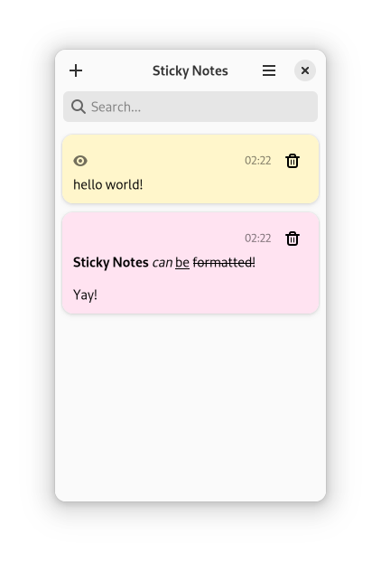
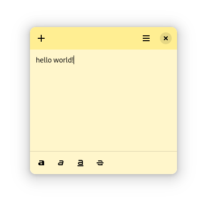

<div align="center">


# Sticky Notes

[](https://stopthemingmy.app) 

Sticky Notes is a simple note taking application for the GNOME desktop. It is
written in GJS and uses GTK4.




</div>

## Installation

### From Flathub

Sticky Notes is available to download on
[Flathub](https://flathub.org/apps/details/com.vixalien.sticky).

<a href="https://flathub.org/apps/details/com.vixalien.sticky" title="Download on Flathub">
  <picture>
    <source media="(prefers-color-scheme: dark)" srcset="data/resources/flathub-badges/download-i.svg">
    <source media="(prefers-color-scheme: light)" srcset="data/resources/flathub-badges/download.svg">
    
  </picture>
</a>

### From source

To install from source, you need `nodejs` and `yarn` installed. Then, you need
to clone the repository by being careful to also pull in the submodules:

```sh
git clone https://github.com/vixalien/sticky.git --recurse-submodules
```

Open the project in GNOME Builder and click "Run Project".

> Note: Other non-Flatpak environments are no longer supported. This is because
Sticky Notes uses an upcoming version of libadwaita.
