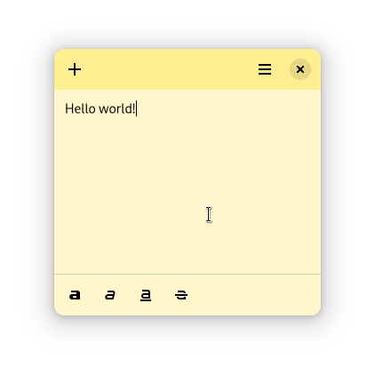
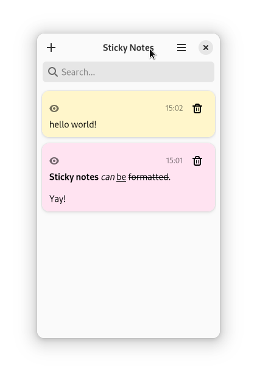

# Sticky Notes

Sticky Notes is a simple note taking application for the GNOME desktop. It is
written in GJS and uses GTK4.





## Installation

### From source

To install from source, you need `nodejs` installed. Then, you need to clone the
repository by being careful to also pull in the submodules:

```sh
git clone https://github.com/vixalien/sticky.git --recurse-submodules
```

Then, you can build and install the application with `meson`:

```sh
meson setup build
ninja -C build
sudo ninja -C build install
```

Tips:

- If you want to run the application without installing it, you can run
  `ninja -C build devel` instead of `sudo ninja -C build install`.
- If you use a different node package manager (like `pnpm`, `bun` etc), you can
  use `meson configure build -Dpackage-manager=<your package manager>` to set
  the package manager. The package manager must support the `install` and `run`
  commands. Note that the default package manager is `yarn`, but you can set it
  to `npm` (which is installed along with nodejs) if you want.
